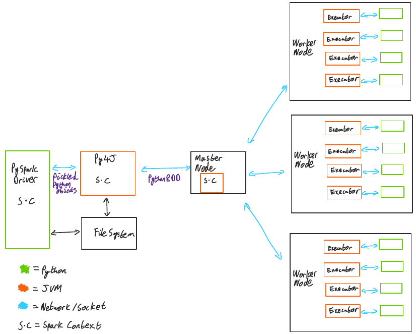

# sdf

## 0. pyspark 의존하는 라이브러리

## Quick Start

~~~
# 위치 확인
$ whatIsPySpark [main] ⚡  pwd
/Users/user/PycharmProjects/whatIsPySpark
~~~

1. poetry 설치
~~~
curl -sSL https://raw.githubusercontent.com/python-poetry/poetry/master/get-poetry.py | python -
~~~

2. 라이브러리 설치
~~~
poetry install
~~~

## 왜 Spark?

python[pandas,sql] 로 데이터 처리 로직을 작성하면 물리적인 노드 1개(로컬컴퓨터1대) 위에서 연산되지만

~~~Python

# python,pandas로 작성한 예시

import pandas as pd

pandas_df = pd.DataFrame({
    'a': [1, 2, 3],
    'b': [2., 3., 4.],
    'c': ['string1', 'string2', 'string3'],
    'd': [date(2000, 1, 1), date(2000, 2, 1), date(2000, 3, 1)],
    'e': [datetime(2000, 1, 1, 12, 0), datetime(2000, 1, 2, 12, 0), datetime(2000, 1, 3, 12, 0)]
})

~~~

pyspark[pandas,sql] 로 로직을 작성하면 물리적인 노드 N개 위에서 연산이 가능함 (코드상 차이가 거의 없음)

~~~Python
# pyspark[pandas]로 작성한 예시
from pyspark.sql import SparkSession
import pandas as pd

pandas_df = pd.DataFrame({
    'a': [1, 2, 3],
    'b': [2., 3., 4.],
    'c': ['string1', 'string2', 'string3'],
    'd': [date(2000, 1, 1), date(2000, 2, 1), date(2000, 3, 1)],
    'e': [datetime(2000, 1, 1, 12, 0), datetime(2000, 1, 2, 12, 0), datetime(2000, 1, 3, 12, 0)]
})
# pandas 로 데이터 처리하는 로직 작성하는것 까지는 동일하고 

# spark 세션에 넣어주는 로직만 추가하면된다.
spark = SparkSession.builder.getOrCreate()
df = spark.createDataFrame(pandas_df)
df
~~~

### What is pyspark? 결론

#### 기존에 `0. pyspark 의존하는 라이브러리`(ex: pandas, sql)를 사용할줄 알거나 이 라이브러리들이 뭐하는 건지 알고있다면 
#### 우리는 당장 pyspark을 사용할줄 아는 것이나 다름없다.(물론 이건 코드 관점에서만...)

위 문장은 마치 "ORM으로 코드를 작성하면 sql을 몰라도된다"와 유사하다 
ORM은 그저 코드상 SQL이 드러나지 않기때문에 몰라도된다고 표현한것이지 

결국 개발 당사자는 ORM내부동작이해와 SQL에 대한 이해가 필요한것처럼  

pyspark도 pandas,numpy...로 코드를 작성해도 알아서 분산처리를 해준다고는하나 
결국 개발 당사자는 내부동작에 대한 이해가 필요.

(다만 이건 천천히 이해해도될듯?, 이거관련된건 스터디를 통해 천천히 하는거로...)

공식문서에 있는 사용법들 보면 그냥 pandas
https://spark.apache.org/docs/latest/api/python/getting_started/quickstart_ps.html#Object-Creation

분산 처리에서 실행계획(execution plan)을 확인해볼수도있다.
https://spark.apache.org/docs/latest/api/python/getting_started/quickstart_ps.html#Object-Creation

### 물론 지금까지 얘기들은 pyspark를 개략적으로 설명한것일뿐 깊게 들어가면 분산처리 관련해서 pyspark에 제공하는 기능들이 점점 나온다

데이터팀 코드를 한번 봐보자

### BentoML on Spark ?

https://engineering.linecorp.com/ko/blog/mlops-bentoml-1/

